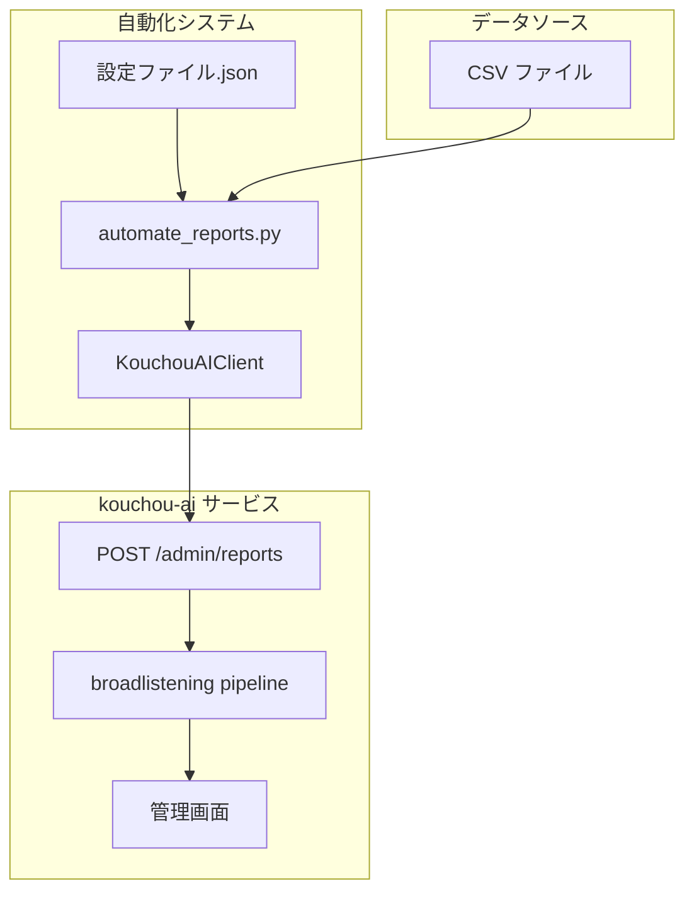

# kouchou-ai レポート生成API自動化ガイド

## 概要

このドキュメントでは、kouchou-aiサービスのAPI経由でレポート生成を自動化する方法について説明します。CSVデータを使用して政策提案プルリクエストの分析レポートを効率的に生成できます。

## 目次

1. [システム構成](#システム構成)
2. [API仕様](#api仕様)
3. [自動化スクリプト](#自動化スクリプト)
4. [設定ファイル](#設定ファイル)
5. [使用方法](#使用方法)
6. [トラブルシューティング](#トラブルシューティング)

## システム構成



## API仕様

### エンドポイント

```
POST {API_BASE_URL}/admin/reports
```

### 認証

```http
x-api-key: {ADMIN_API_KEY}
Content-Type: application/json
```

### リクエストボディ

```json
{
  "input": "report-id-001",
  "question": "レポートタイトル",
  "intro": "レポートの説明",
  "comments": [
    {
      "id": "pr-1",
      "comment": "プルリクエストの内容",
      "source": "GitHub PR",
      "url": "https://github.com/..."
    }
  ],
  "cluster": [5, 25],
  "provider": "openai",
  "model": "gpt-4o-mini",
  "workers": 1,
  "prompt": {
    "extraction": "意見抽出プロンプト",
    "initial_labelling": "初期ラベリングプロンプト",
    "merge_labelling": "統合ラベリングプロンプト",
    "overview": "概要生成プロンプト"
  },
  "is_pubcom": false,
  "inputType": "file",
  "is_embedded_at_local": false,
  "enable_source_link": true
}
```

### レスポンス

成功時: `HTTP 200` または `HTTP 202`

```json
{
  "message": "Report creation started successfully"
}
```

## 自動化スクリプト

### KouchouAIClient クラス

```python
from automate_reports import KouchouAIClient, ReportConfig

# クライアント初期化
client = KouchouAIClient(
    api_base_url=os.getenv("KOUCHOU_AI_API_URL"),
    admin_api_key=os.getenv("ADMIN_API_KEY")
)

# レポート作成
config = ReportConfig(
    input="energy-policy-analysis",
    question="エネルギー関連政策提案プルリクエスト分析7/8時点",
    intro="エネルギー政策に関する分析レポート",
    csv_file_path="/path/to/energy_prs.csv",
    cluster=[5, 25]
)

success = client.create_report(config)
```

### 主要メソッド

#### `create_report(config: ReportConfig) -> bool`
- レポートを作成します
- CSVファイルを読み込み、APIに送信
- 成功時は `True`、失敗時は `False` を返却

#### `get_report_status(report_id: str) -> Dict[str, Any]`
- レポートの処理状況を取得
- トークン使用量、現在のステップなどを確認可能

#### `_load_csv_data(csv_file_path: str) -> List[Dict[str, Any]]`
- CSVファイルを読み込み、API形式に変換
- GitHub PR形式（text/url）と従来形式の両方に対応

## 設定ファイル

### レポート設定例

```json
{
  "reports": [
    {
      "input": "energy-policy-pr-analysis-7-8",
      "question": "エネルギー関連政策提案プルリクエスト分析7/8時点",
      "intro": "7/8時点のエネルギー関連政策提案プルリクエストを分析しました。",
      "csv_file_path": "/path/to/energy_prs.csv",
      "cluster": [5, 25],
      "provider": "openai",
      "model": "gpt-4o-mini",
      "workers": 1,
      "is_pubcom": false,
      "is_embedded_at_local": false,
      "enable_source_link": true
    }
  ]
}
```

### 設定パラメータ

| パラメータ | 説明 | デフォルト値 |
|-----------|------|-------------|
| `input` | レポートID（一意） | 必須 |
| `question` | レポートタイトル | 必須 |
| `intro` | レポート説明文 | 必須 |
| `csv_file_path` | CSVファイルパス | 必須 |
| `cluster` | クラスタリング設定 [level1, level2] | `[5, 25]` |
| `provider` | LLMプロバイダー | `"openai"` |
| `model` | 使用モデル | `"gpt-4o-mini"` |
| `workers` | 並列処理数 | `1` |

## 使用方法

### 1. 環境設定

```bash
# 環境変数設定
export ADMIN_API_KEY="your-admin-api-key"
export KOUCHOU_AI_API_URL="your-api-base-url"
```

### 2. CSVファイル準備

#### GitHub PR形式
```csv
text,url
"プルリクエストの内容","https://github.com/..."
"別のプルリクエスト","https://github.com/..."
```

#### 従来形式
```csv
id,comment,source,url
"pr-1","コメント内容","GitHub PR","https://github.com/..."
"pr-2","別のコメント","GitHub PR","https://github.com/..."
```

### 3. 単一レポート作成

```bash
cd scripts
python create_second_report.py
```

### 4. 複数レポート一括作成

#### 従来方式（固定間隔）
```bash
cd scripts
export ADMIN_API_KEY="your-api-key"
python automate_reports.py
```

#### インテリジェント方式（API監視）
```bash
cd scripts
export ADMIN_API_KEY="your-api-key"
python intelligent_report_automation.py
```

### 5. 進捗確認

管理画面でレポートの処理状況を確認：
```
{ADMIN_INTERFACE_URL}
```

## 処理パイプライン

レポート生成は以下の8ステップで処理されます：

1. **抽出 (extraction)** - コメントから意見を抽出
2. **埋め込み (embedding)** - テキストのベクトル化
3. **意見グループ化 (hierarchical)** - 階層クラスタリング
4. **初期ラベリング (initial_labelling)** - グループの初期ラベル付け
5. **統合ラベリング (merge_labelling)** - ラベルの統合・調整
6. **概要生成 (overview)** - 全体概要の作成
7. **集約 (aggregation)** - データの集約処理
8. **可視化 (visualization)** - 結果の可視化

## メモリ最適化

### インテリジェント待機

大量のレポートを処理する際は、API状況を監視して適切なタイミングで次のレポートを作成：

```python
def wait_for_processing_completion(client):
    """処理中レポートの完了を待機"""
    while True:
        processing_reports = check_processing_reports(client)
        if not processing_reports:
            return True  # 処理中レポートなし
        time.sleep(30)  # 30秒後に再チェック

for i, config in enumerate(configs):
    if i > 0:  # 最初のレポート以外は待機
        wait_for_processing_completion(client)
    success = client.create_report(config)
```

### 推奨設定

- **workers**: `1` （並列処理数を制限）
- **待機方式**: API状況監視による動的待機
- **cluster設定**: `[5, 25]` （適度なクラスタ数）
- **タイムアウト**: 60分（長時間処理対応）

## トラブルシューティング

### よくある問題

#### 1. API認証エラー
```
HTTP 401 Unauthorized
```

**解決方法:**
- `ADMIN_API_KEY` 環境変数が正しく設定されているか確認
- APIキーの有効性を確認

#### 2. CSVファイル読み込みエラー
```
FileNotFoundError: CSV file not found
```

**解決方法:**
- ファイルパスが正しいか確認
- ファイルの存在とアクセス権限を確認

#### 3. レポートが "extraction" ステップで停止
```
current_step: "extraction", token_usage: 0
```

**解決方法:**
- CSVデータの形式を確認
- プロンプト設定を見直し
- ログファイルでエラー詳細を確認

#### 4. メモリ不足エラー
```
Out of Memory (OOM)
```

**解決方法:**
- 並列処理数を削減（workers=1）
- 処理間隔を延長（60秒以上）
- データサイズを分割

### デバッグ用スクリプト

```python
# レポート状況確認
status = client.get_report_status("report-id")
print(f"Current step: {status.get('current_step')}")
print(f"Token usage: {status.get('token_usage', 0)}")
```

## 実装例

### インテリジェント自動化例

```python
#!/usr/bin/env python3
import os
from intelligent_report_automation import create_reports_intelligently, wait_for_processing_completion
from automate_reports import KouchouAIClient, ReportConfig

def create_policy_reports_intelligently():
    """政策分野別レポートをAPI監視で順次作成"""
    
    # 環境設定
    api_key = os.getenv("ADMIN_API_KEY")
    api_url = os.getenv("KOUCHOU_AI_API_URL")
    
    client = KouchouAIClient(api_url, api_key)
    
    # レポート設定
    reports = [
        {
            "topic": "エネルギー",
            "csv_path": "/data/energy_prs.csv"
        },
        {
            "topic": "医療",
            "csv_path": "/data/medical_prs.csv"
        },
        {
            "topic": "教育",
            "csv_path": "/data/education_prs.csv"
        }
    ]
    
    # インテリジェント順次処理
    for i, report_info in enumerate(reports):
        # 前のレポート完了を待機
        if i > 0:
            print(f"Waiting for previous reports to complete...")
            wait_for_processing_completion(client, max_wait_minutes=60)
        
        config = ReportConfig(
            input=f"{report_info['topic'].lower()}-policy-analysis",
            question=f"{report_info['topic']}関連政策提案プルリクエスト分析7/8時点",
            intro=f"7/8時点の{report_info['topic']}関連政策提案プルリクエストを分析しました。",
            csv_file_path=report_info['csv_path'],
            cluster=[5, 25]
        )
        
        print(f"Creating {report_info['topic']} report...")
        success = client.create_report(config)
        
        if success:
            print(f"✅ {report_info['topic']} report created successfully")
        else:
            print(f"❌ Failed to create {report_info['topic']} report")

if __name__ == "__main__":
    create_policy_reports_intelligently()
```

## 参考資料

- [kouchou-ai GitHub Repository](https://github.com/team-mirai/kouchou-ai)
- [API仕様書](../server/src/routers/admin_report.py)

## 更新履歴

- 2025/07/08: 初版作成
- 実装済み機能: 順次処理、CSV形式自動判定、エラーハンドリング
- テスト済み: エネルギー関連レポート（213件）、マイナンバーカード関連レポート（30,084件）
